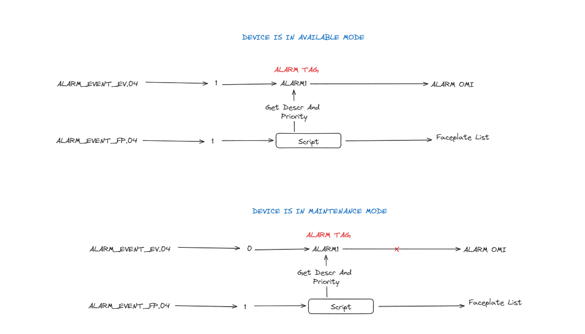

# AlarmDataMonitor 

Contains logic for monitoring alarms & populating alarm faceplate

Tag attribute names are configured in *BusinessLogic/AlarmMonitorConfig.cs*

[Variable Naming Conventions](https://rwomcs.atlassian.net/wiki/spaces/SD/pages/30769153/Variable+Nomenclature+Standard)

## Alarm
**OnChange Triggers to populate Faceplate**
- AssetInstance1.AlarmX
    - where "X" is an int (1 - 16)

**Population flow**
- Trigger: AssetInstance1.Alarm = true
- Find alarms AssetInstance1.Alarm1 -> AssetInstance1.Alarm16
    - True/False (set / not set)
- For set alarms (TRUE), get "description" & "priority" from static extended attributes
    - Me.Alarm16.Description & Me.Alarm16.Priority
- Sort all active alarms that were collected by priority
- populate array **AssetInstance1.ALARMLIST** with "description"
    - ALARMLIST = [[dsaf], [dsaf], [dsaf]]

## Fault/Event Alarm

**OnChange Triggers to populate Faceplate**
- AssetInstance1.ALARM_EVENT_EV  set by PLC (ie: 34892380)
    - array of bits we get from **PLC**
- AssetInstance1.ALARM_EVENT_FP  set by PLC (ie: 34892380)
    - array of bits we get from **PLC**

**Population flow**
- Find alarms AssetInstance1.ALARM_EVENT_FP
    - AssetInstance1.ALARM_EVENT_FP.00 -> 31
    - True/False (set / not set)
- For set alarms (TRUE), get "description" & "priority" from static extended attributes (in **ALARM_EVENT_EV1)**
    - AssetInstance1.ALARM_EVENT_FP.00 is associated with AssetInstance1.ALARM_EVENT_EV1
        - and so on .ALARM_EVENT_FP.01 -> ALARM_EVENT_EV2
    - AssetInstance1.ALARM_EVENT_EV1.Description &  AssetInstance1.ALARM_EVENT_EV1.Priority
- Sort all active alarms that were collected by priority
- populate array **AssetInstance1.ALARMLIST** with "description"
    - ALARMLIST = [[dsaf], [dsaf], [dsaf]]

